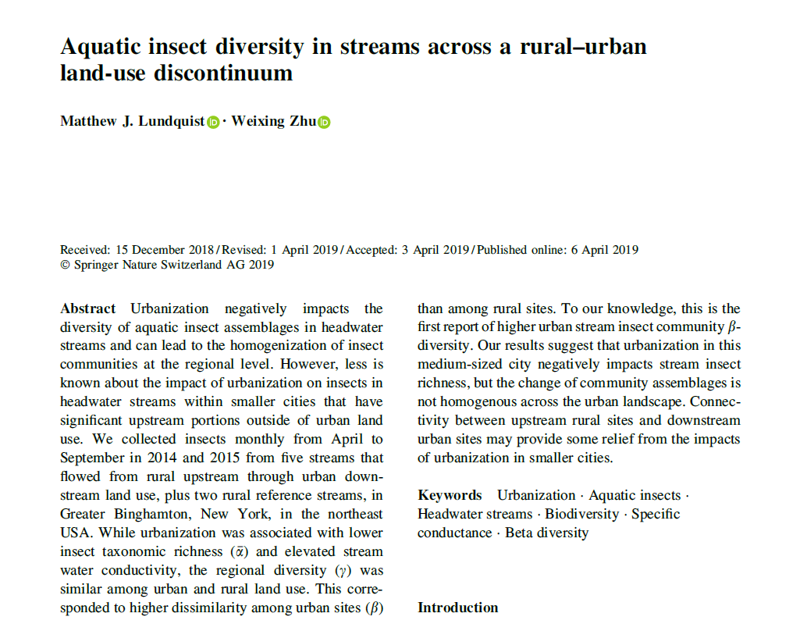

Data and example data analysis techniques in R. 

Original paper: [Aquatic insect diversity in streams across a rural–urban land-use discontinuum](https://link.springer.com/article/10.1007/s10750-019-3955-2)

Companion dataset: [https://github.com/lundquist-ecology-lab/aquatic_insec_nutrients](https://github.com/lundquist-ecology-lab/aquatic_insec_nutrients)